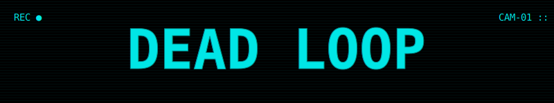
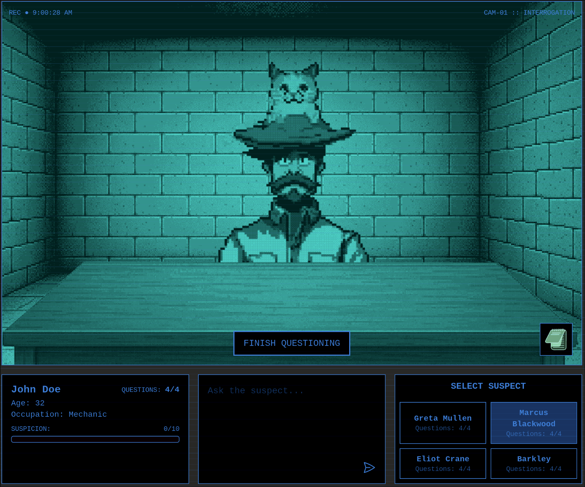
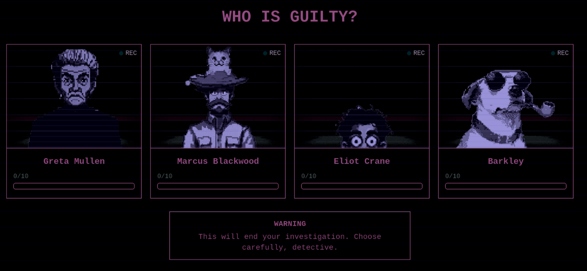

<div align="center">
  
</div>

<div align="center">
  
  
  
  
</div>

##

<p align="center">
  An interactive murder mystery investigation game with AI-driven narrative generation. Players take on the role of a detective who must interrogate suspects, discover clues, and ultimately solve the case by identifying the killer.
</p>

<div align="center">
  
</div>

<div align="center">
  
  ## 📋 Table of Contents
  
  [📖 Overview](#overview)  
  [✨ Features](#features)  
  [🛠️ Technologies Used](#technologies-used)  
  [📦 Installation](#installation)  
  [🚀 Usage](#usage)  
  [🧩 Project Structure](#project-structure)  
  [📋 Dependencies](#dependencies)  
  [📄 License](#license)  
  [👥 Credits](#credits)
  
</div>

## 📖 Overview

Dead Loop is an interactive murder mystery investigation game with AI-driven narrative generation. Players take on the role of a detective who must interrogate suspects, discover clues, and ultimately solve the case by identifying the killer.

## ✨ Features

- **AI-Generated Content**: Each case is uniquely created by AI, including victim details, murder scenes, and suspect profiles
- **Interactive Interrogation**: Question suspects using natural language and receive dynamic AI-powered responses
- **Clue Discovery System**: Uncover hidden clues based on your conversation with suspects
- **Suspicion Tracking**: Monitor how suspicious each character appears as you gather evidence
- **Retro Security Camera Aesthetic**: Immersive UI with a green-tinted security camera visual style

## 🛠️ Technologies

- **Frontend**: React, TypeScript, Vite, Framer Motion
- **Backend**: Node.js, Fastify, WebSockets
- **AI**: OpenAI GPT API
- **State Management**: Zustand
- **Styling**: TailwindCSS

## 📦 Installation

1. Clone the repository:
   ```bash
   git clone https://github.com/janrau9/HAIV.git
   cd HAIV
   ```

2. Create an `.env` file in the `/backend` directory with your OpenAI API key:
   ```
   NEXT_PUBLIC_OPENAI_KEY="your-openai-api-key-here"
   ```

## 🚀 Usage

1. Start the application using the Makefile:
   ```bash
   make
   ```

2. Open your browser and navigate to:
   ```
   http://localhost:5173
   ```

3. Click "New Game" to start a new investigation 🕵️‍♂️

4. Question the suspects by typing in the input field 💬

5. Monitor suspicion levels and discovered clues in the notebook 📝

6. When you are ready (or out of questions), make your accusation by selecting "Finish Questioning" ⚠️

<div align="center">
  
</div>

## 🧩 Project Structure

```
.
├── backend/              # Node.js server with Fastify
│   ├── ai.ts             # OpenAI integration
│   ├── aiService.ts      # AI service for generating content and responses
│   ├── prompts/          # Prompt templates for AI
│   ├── routes.ts         # API routes
│   └── WsController.ts   # WebSocket controller
├── frontend/             # React frontend
│   ├── src/
│   │   ├── components/   # UI components
│   │   ├── contexts/     # React contexts
│   │   ├── store.ts      # Zustand state management
│   │   └── App.tsx       # Main application component
│   └── public/           # Static assets
└── types/                # Shared TypeScript type definitions
```

## 📋 Dependencies

- Node.js (v16+)
- npm or yarn
- OpenAI API key

## 📄 License

[MIT](LICENSE)

## 👥 Credits

<div align="center">
  
[Janrau](https://github.com/janrau9) • 
[Lassi](https://github.com/lassikon) • 
[Valle](https://github.com/Vallehtelia) • 
[Olli](https://github.com/koodikommando) • 
[Jarno](https://github.com/Jarnomer)

</div>